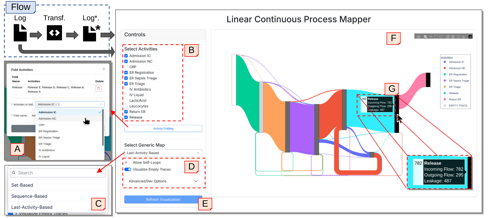

# Linear Continuous Process Mapper

A prototypical implementation of linear and continuous process maps for the exploratory analysis of sequential behavior in event logs. This Python application builds upon interactive Sankey diagrams to provide effective visualizations of process behavior. The system loads event logs, constructs process maps using different abstractions (such as sequence-based, set-based, and last-activity-based), and visualizes them to display relevant insights in a precise yet interpretable way.

## Overview

Usage flow and UI of the application. Users can either provide an event log as-is or apply further transformations in a Jupyter notebook (Flow). The UI supports folding activities (A) and activity selection (B). Furthermore, users can select from the three generic LCMs: sequence-, set-, or last-activity abstraction (C) and choose whether to visualize self-loops and empty traces (D). After selecting the desired visualization controls, they can refresh the visualization (E), which refreshes the Sankey diagram (F). Here, they can freely reposition nodes to adjust the  visualization to their needs. More details about edges and nodes are revealed on hover (G).

## How to Run

**Standalone Web Application (UI-only)**: Run `python main.py` from the project root. Specify the file path of the event log that
should be analyzed. To specify a different dataset, modify the `file_name` variable in `main.py`. This mode provides the web interface without the ability for interactive Python-based log enrichments.

**Jupyter Notebook**: The Jupyter notebook is especially meant for experimentation with log transformations beyond the ones offered in the UI. Open and run `app_notebook_basic.ipynb` as a general template, or `app_notebook_RF_enrichment.ipynb` which serves as an example.

## Project Structure

**Supplementary Material**: A PDF document mapped to the paper's supplementary material is located in the root of the repository.

**main.py** - The main entry point for running the standalone web application.

**dapp_fact.py** - Dash Application factory unifying standalone and Jupyter notebook deployments.

**app** - Application factory and dependency injection layer. Contains the main logic that wires together all
components (data processors, graph builders, analyzers) to create the complete process analytics service.

**core** - Core business logic containing the main analytical components:

- **data** - Event log data handling using PM4Py. Loads XES files, processes event logs, filters by activities, and
  creates case-level variants for analysis
- **domain** - Graph analysis algorithms that enrich process graphs with business metrics including flow analysis,
  leakage detection, termination ratios, and node balancing
- **graph_builders** - Multiple strategies for constructing process graphs from event data: set-based prefix graphs,
  sequence-based prefix trees, and last-activity-based graphs with configurable loop handling
- **services** - High-level orchestration services that coordinate graph construction, simplification, and the complete
  analytics pipeline from raw data to visualizations
- **visualization** - Interactive Sankey diagram generator using Plotly that converts enriched process graphs into
  color-coded flow visualizations with hover details and activity legends

**layout** - Dash-based web application frontend providing interactive controls for activity selection, graph builder
choice, visualization simplification options, and the main graph display area

## Repository Authors
- [@moritzfaes](https://github.com/moritzfaes)
- [@hvoelzer](https://github.com/hvoelzer)
- [@aaronkurz](https://github.com/aaronkurz)
